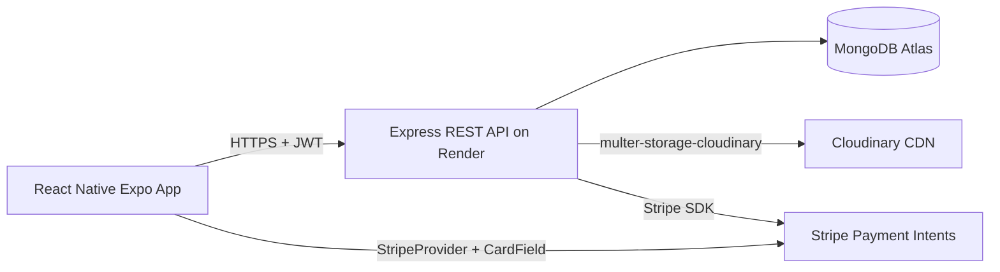
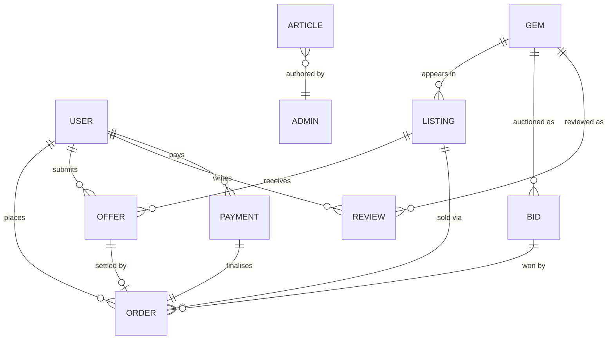

# GemMarket — Full-Stack Mobile Gemstone Marketplace

**SE2020 — Web and Mobile Technologies · Group Assignment (6 students, 8 weeks)**

A full-stack mobile gemstone marketplace where customers can browse listings, make offers, bid in auctions, pay via Stripe, and track orders to delivery. Admins manage inventory, publish learning articles, run auctions, and approve/reject offers.

| Layer | Tech |
|---|---|
| Mobile | React Native (Expo SDK 54 managed) + Reanimated v4 + Linear Gradient + Lottie + Haptics |
| Backend | Node.js + Express 4.21 |
| Database | MongoDB Atlas (9 collections) |
| Auth | JWT + bcrypt |
| File storage | Cloudinary (images + videos) |
| Payments | Stripe (test mode) |
| Hosting | Render (backend), MongoDB Atlas (DB), Cloudinary (CDN) |
| E2E tests | Playwright (12 specs) on Expo web build |
| Design | Light theme · royal purple #6D28D9 on white · amber accents · 16+ reusable components |

> **Live demo URL:** _to be filled in after Phase 8 deployment_
> **Admin login:** `admin@gemmarket.local` / `<ADMIN_PASSWORD>` from `.env`

## 1 · Problem Statement

Independent gem dealers and small jewellers struggle to reach buyers beyond walk-in clientele. Existing global marketplaces are heavily commission-based and don't support the mixed pricing models that gem trading actually uses — fixed-price for retail, negotiation for high-value pieces, and timed auctions for rare specimens. **GemMarket** gives a single dealer (the admin) all three sales channels in one mobile app, while customers get a unified browsing/buying/tracking experience and an educational hub to learn about what they're buying.

## 2 · System Architecture



- **Mobile** sends JSON / multipart over HTTPS, attaching `Authorization: Bearer <jwt>` for protected routes
- **API** auth middleware verifies JWT, attaches `req.user`; `adminOnly` middleware gates write-side admin routes
- **Cloudinary** stores all images/videos; only the URL is persisted in Mongo
- **Stripe** processes the actual card; the API only stores the transaction reference, never card details

See [docs/architecture.md](docs/architecture.md) for the full diagram and request flows.

## 3 · Database Schema



Detailed field tables in [docs/schema.md](docs/schema.md).

## 4 · API Endpoint Table

| Module | Method | Path | Auth |
|---|---|---|---|
| Auth | POST | `/api/auth/register` | public |
| Auth | POST | `/api/auth/login` | public |
| Auth | GET | `/api/auth/me` | token |
| Inventory | GET / POST / PUT / DELETE | `/api/inventory[/:id]` | admin |
| Learning | GET | `/api/learning?category=` | public |
| Learning | GET | `/api/learning/:id` | public |
| Learning | POST / PUT / DELETE | `/api/learning[/:id]` | admin (multipart) |
| Marketplace | GET | `/api/marketplace?q=&category=&min=&max=` | public |
| Marketplace | GET | `/api/marketplace/:id` | public |
| Marketplace | POST / PUT / DELETE | `/api/marketplace[/:id]` | admin (multipart) |
| Offers | POST | `/api/offers` | customer |
| Offers | GET | `/api/offers/mine` | customer |
| Offers | GET | `/api/offers` | admin |
| Offers | PATCH | `/api/offers/:id` | admin |
| Bids | GET | `/api/bids[/:id]` | public (lazy-closes expired) |
| Bids | POST / DELETE | `/api/bids[/:id]` | admin |
| Bids | POST | `/api/bids/:id/place` | customer |
| Orders | GET | `/api/orders` (mine) | token |
| Orders | GET | `/api/orders/all` | admin |
| Orders | GET | `/api/orders/:id` | owner or admin |
| Orders | PATCH | `/api/orders/:id` | admin (advance status) |
| Orders | DELETE | `/api/orders/:id` | owner (Confirmed only) or admin |
| Reviews | GET | `/api/reviews/:gemId` | public |
| Reviews | POST | `/api/reviews` | customer (delivered orders only) |
| Reviews | DELETE | `/api/reviews/:id` | admin |
| Payments | POST | `/api/payments` | customer |
| Payments | GET / GET | `/api/payments[/:id]` | admin |

Full request/response examples in [docs/api.md](docs/api.md).

## 5 · Team Responsibility Breakdown

| Member | Entity owned | Module | Cloudinary? |
|---|---|---|---|
| Group | User | Authentication (register, login, JWT, bcrypt) | — |
| **M1** | Gem | Inventory CRUD (admin only) | No |
| **M2** | Article | Learning Hub (categories, body, cover image) | Cover image |
| **M3** | Listing + Offer | Direct Marketplace + Negotiation | Photos + video |
| **M4** | Order + Review | Order tracking + post-delivery reviews | No |
| **M5** | Bid | Auction system + lazy-close on read | No |
| **M6** | Payment | Stripe integration + Cloudinary pipeline + Render deployment | Pipeline owner |

Each member's per-module viva notes live in [docs/viva-notes/](docs/viva-notes/).

## 6 · Repository Layout

```
WMT/
├── README.md                           ← you are here
├── GemMarket — Full Component Workflow Docu.md   ← spec (source of truth)
├── docs/
│   ├── setup.md                        ← local dev walkthrough (Atlas/Cloudinary/Stripe/Render)
│   ├── architecture.md                 ← system diagram + request flows
│   ├── schema.md                       ← per-collection field reference
│   ├── api.md                          ← endpoint examples
│   ├── deployment.md                   ← step-by-step Render walkthrough
│   └── viva-notes/                     ← per-member study notes (M1.md … M6.md)
├── backend/                            ← Express + Mongoose API
│   ├── server.js  config/  middleware/  models/  controllers/  routes/  utils/  scripts/
└── mobile/                             ← Expo React Native app
    ├── App.js  app.json  babel.config.js
    └── src/  api/  context/  navigation/  components/  screens/  theme.js
```

## 7 · Quick Start

```bash
# Backend
cd backend
cp .env.example .env          # fill MONGO_URI, JWT_SECRET, CLOUDINARY_*, STRIPE_*
npm install
npm run seed:admin
npm run dev                   # → http://localhost:5000

# Mobile (in another terminal)
cd mobile
cp .env.example .env          # set EXPO_PUBLIC_API_URL to your LAN IP, EXPO_PUBLIC_STRIPE_PK
npm install
npx expo start                # scan QR with Expo Go on your phone
```

Detailed setup in [docs/setup.md](docs/setup.md).

## 8 · Verification (smoke test)

The master verification doc is **[docs/E2E_VERIFICATION.md](docs/E2E_VERIFICATION.md)** — 5 layers (boot · parse · API contract · Playwright e2e · 15-step manual).

Quick versions:
- 15-step manual flow → [docs/verification.md](docs/verification.md)
- Automated Playwright (12 specs) → [e2e/README.md](e2e/README.md) — `cd e2e && npm test`
- Design system reference → [docs/DESIGN_SYSTEM.md](docs/DESIGN_SYSTEM.md)
- Future improvements list → [docs/SUGGESTIONS.md](docs/SUGGESTIONS.md)

## 9 · Important rules from the brief

- All 6 members must attend viva and explain their own module
- Plagiarism = 0 marks
- AI tools allowed for learning support, **not** full system generation
- Backend must be hosted online; localhost demo not allowed for final evaluation
