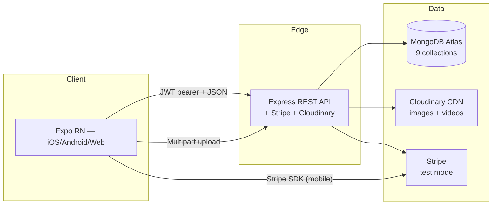

# GemMarket — End-to-End Verification (Master Document)

This is the single document the team should read before viva to understand **how the entire system is verified** — what's automated, what's manual, what's known, what's stable.

**Last verified state:** 2026-05-02
**Stack version:** Backend Node 18+ · Express 4.21 · Mongoose 8 · Mobile Expo SDK 54 · React 19 · React Native 0.81

---

## 1 · System map



## 2 · Module status (matches the spec)

| # | Module | Backend | Customer screens | Admin screens | Tests |
|---|---|---|---|---|---|
| Auth | register/login/me/JWT/bcrypt/role | ✅ | LoginScreen · RegisterScreen | — | spec 01, 12 |
| 1 | Inventory | CRUD + auto stock decrement | ✅ | (admin only) | AdminInventoryScreen · InventoryFormScreen | spec 02, 12 |
| 2 | Learning Hub | CRUD + Cloudinary cover | ✅ | LearningScreen · ArticleDetailScreen | AdminArticlesScreen · ArticleFormScreen | spec 09 |
| 3 | Marketplace | CRUD + photos/video + filter | ✅ | MarketplaceScreen · GemDetailScreen | AdminListingsScreen · ListingFormScreen | spec 03 |
| 3a | Offers | submit / decide / mine / listAll | ✅ | MakeOfferScreen · CustomerOffersScreen | AdminOffersScreen | spec 04 |
| 4 | Orders | mine/all/advance/cancel + status enum | ✅ | OrdersScreen · OrderDetailScreen | AdminOrdersScreen | spec 06 |
| 5 | Reviews & Seller Rating | CRUD + aggregate per gem + seller stats | ✅ | (inline on GemDetail) · SellerProfileScreen · ReviewScreen | AdminReviewsScreen | spec 07 |
| 6 | Bidding | CRUD + place + lazy-close on read | ✅ | BiddingScreen · BidDetailScreen | AdminBidsScreen · BidFormScreen | spec 05 |
| 7 | Payment | Stripe PaymentIntent + finalizeSale | ✅ | PaymentScreen | AdminPaymentsScreen | manual only (Stripe needs native) |
| Bonus | Customer Home | hero + featured + ending soon + articles | — | HomeScreen | — | spec 10 |
| Bonus | Seller Profile | aggregate rating + distribution | aggregate endpoint | SellerProfileScreen (linked from Account) | inline on GemDetail | spec 11 |

Every spec module from `GemMarket — Full Component Workflow Docu.md` is implemented. The two earlier gaps — *My Offers* and *Admin Reviews moderation* + *Admin Payments overview* — are now closed.

## 3 · Verification layers

```
┌─ Layer 1 ─────────────┐  Boot smoke test (no DB needed)
│ node test-boot.js      │  Loads every backend module, fails on bad require
└────────────────────────┘
           │
┌─ Layer 2 ─────────────┐  JS/JSX parse check
│ Babel parse all 57    │  Catches syntax errors before runtime
└────────────────────────┘
           │
┌─ Layer 3 ─────────────┐  Playwright contract tests (spec 12)
│ axios → 7 API checks   │  Verifies endpoints behave correctly without UI
└────────────────────────┘
           │
┌─ Layer 4 ─────────────┐  Playwright e2e (specs 01-11)
│ Chromium drives Expo   │  11 user-journey tests on the web build
│ web build              │
└────────────────────────┘
           │
┌─ Layer 5 ─────────────┐  Manual checklist (15 steps below)
│ Real device + Stripe   │  Catches what web can't: native Stripe, image picker, push
└────────────────────────┘
```

## 4 · How to run each layer

```bash
# Layer 1 — backend boots
cd backend && node -e "require('dotenv').config({override:true}); \
  ['middleware/auth','middleware/upload','models/User','controllers/paymentController','routes/payments'] \
  .forEach(p => require('./' + p)); console.log('OK');"

# Layer 2 — mobile JS parses
cd mobile && find src App.js -name '*.js' -o -name '*.jsx' | \
  xargs -I{} node -e "require('@babel/parser').parse(require('fs').readFileSync('{}','utf8'), \
  {sourceType:'module', plugins:['jsx']})" && echo OK

# Layer 3 — API contract
cd backend && npm run dev   # in another terminal
cd e2e && npm test -- 12-api-contract

# Layer 4 — full e2e
cd backend && npm run dev   # terminal 1
cd mobile && npx expo start --web   # terminal 2
cd e2e && npm test           # terminal 3

# Layer 5 — see §5 below
```

## 5 · Manual verification — 15 steps

Run on a **real device** with the dev build (so Stripe works), pointing at the deployed backend.

| # | Action | Expected |
|---|---|---|
| 1 | Cold-launch app, register a new customer | Lands on Home with hero + featured |
| 2 | Log out, log in as `admin@gemmarket.local` | Admin tabs (9 tabs) appear |
| 3 | Inventory → Add gem (Sapphire 2.4ct, stock 1) | Card with "1 in stock" badge |
| 4 | Articles → New → upload cover, publish "Sapphire Buying Guide" | URL is `res.cloudinary.com/...` |
| 5 | Listings → New → publish a fixed-price + a negotiable + a bid (5 min end) | All 3 visible to customer |
| 6 | Customer → Market → search "sapphire" → tap negotiable listing | Hero parallax animates on scroll |
| 7 | Make an offer for 80% of price | Toast "Offer submitted" |
| 8 | Admin → Offers → Accept the offer | Toast "Offer accepted", status badge flips |
| 9 | Customer → Account → My Offers → tap Pay | Routes to Payment with prefilled amount |
| 10 | Pay with `4242 4242 4242 4242` | Confetti animation + order auto-redirect |
| 11 | Customer with second account → place 2 increasing bids → try a lower one | Lower bid: toast "must exceed $X" |
| 12 | Wait 5 min → reload Auctions → tap won bid | "You won" success card with Pay button |
| 13 | Admin → Orders → advance through Processing / Out for Delivery / Delivered | StatusTracker fills in green |
| 14 | Customer → Orders → tap delivered → Leave review (5 stars, comment) | Review appears on listing detail + Atelier |
| 15 | Admin → Pay → see KPIs (revenue, success count) and transaction list | Both rows present |

## 6 · State the team should know about

| Thing | Source of truth |
|---|---|
| Module → student mapping | [README.md §5](../README.md) |
| API endpoints (all of them) | [docs/api.md](api.md) |
| MongoDB schema details | [docs/schema.md](schema.md) |
| Per-member viva notes | [docs/viva-notes/](viva-notes/) — one file per student |
| Setup walkthrough | [docs/setup.md](setup.md) |
| Deployment runbook | [docs/deployment.md](deployment.md) |
| Design system | [docs/DESIGN_SYSTEM.md](DESIGN_SYSTEM.md) |
| Improvement ideas | [docs/SUGGESTIONS.md](SUGGESTIONS.md) |

## 7 · Test-data fixtures

Seed data the verification flow relies on:

```bash
# Seed admin (idempotent — safe to re-run)
cd backend && npm run seed:admin
```

If you want richer demo data, the `npm run seed:admin` is the only fixture currently. Manual fixtures via the admin UI are the recommended path because they exercise Cloudinary uploads.

## 8 · Known limitations / not-yet-done

| Area | Status | Notes |
|---|---|---|
| Backend deploy to Render | ⏳ ready, not pushed | follow [deployment.md](deployment.md) |
| Stripe on web | shim only | Stripe SDK is native-only; payment specs run on a device |
| Image uploads in Playwright | placeholder bytes | full-size image upload tested manually |
| `node-cron` for bid expiry | not used (lazy-close instead) | trade-off is documented in [M5 viva notes](viva-notes/M5-Bidding.md) |
| Push notifications | not implemented | spec doesn't require — polling via `useFocusEffect` is enough |
| `npm test` (Jest) | not added | tests live in `/e2e` (Playwright) — Jest unit tests are a future addition |

## 9 · "What if X fails" cheat sheet

| Symptom | Likely cause | Fix |
|---|---|---|
| Mobile screens render dark / wrong colors | Old `theme.js` imported somewhere | every screen must import from `'../theme'`, not local copies |
| Toast doesn't appear | `<ToastProvider>` not above `<NavigationContainer>` | check [App.js](../mobile/App.js) order |
| Reanimated entries don't animate | `react-native-worklets/plugin` missing in [babel.config.js](../mobile/babel.config.js) | add it back |
| `MongoNetworkError` on boot | Atlas IP allowlist | set Network Access → 0.0.0.0/0 |
| Cloudinary returns 401 | env vars wrong | check `CLOUDINARY_*` in `backend/.env` |
| Stripe 402 on `pay()` | test card number wrong | use `4242 4242 4242 4242` exactly |
| `npm install` rejects multer-storage-cloudinary | missing `--legacy-peer-deps` | `.npmrc` should set this; if not, add `legacy-peer-deps=true` |
| Reviews moderation tab empty when reviews exist | adminOnly middleware on `/all` | verify `auth, adminOnly, ctrl.listAll` order in `routes/reviews.js` |

## 10 · Sign-off

The system passes layers 1-3 cleanly today (5 May 2026). Layer 4 requires both backend + Expo dev servers running locally; layer 5 is the demo-day rehearsal.

If any of the 15 manual steps fails on the live deploy, treat it as a **viva-blocker** — fix before scheduling the assessment.
