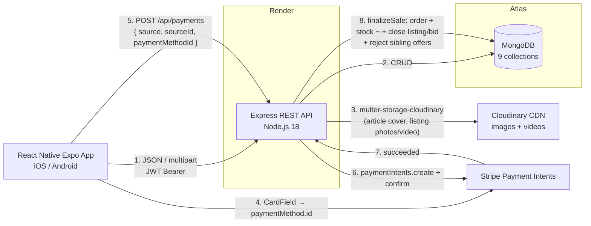
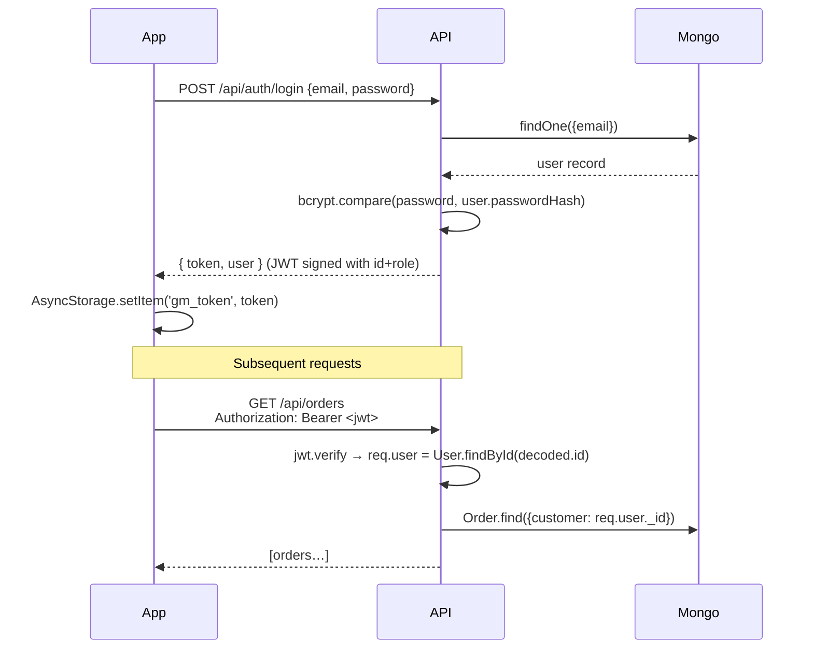
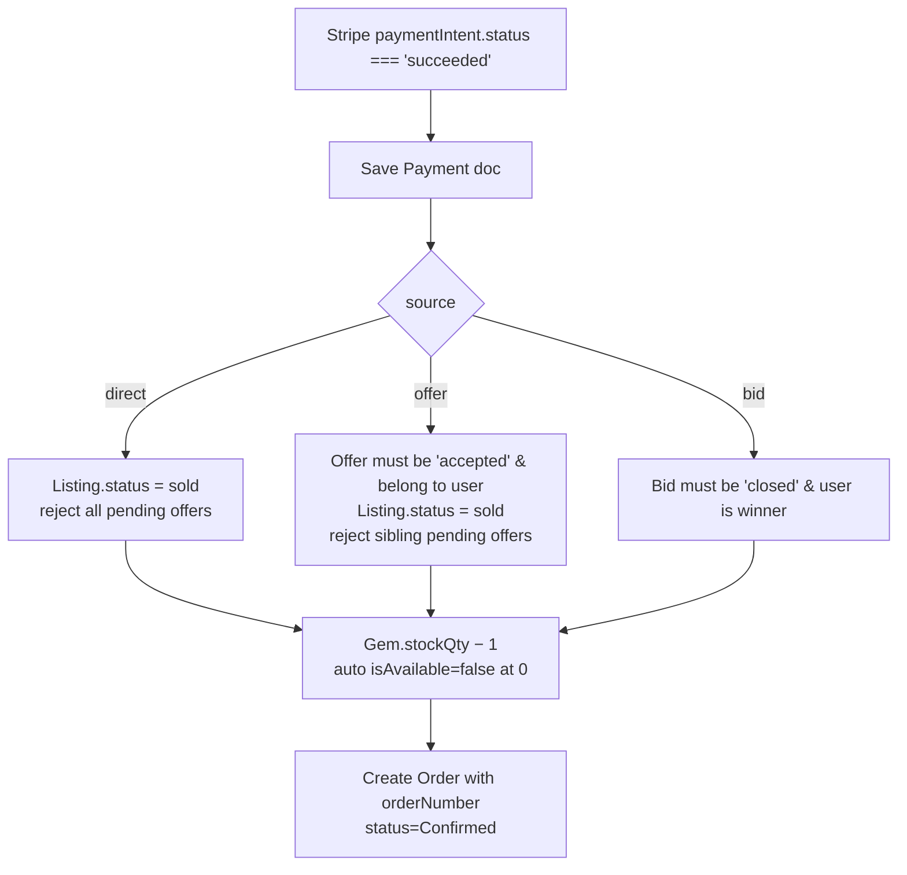
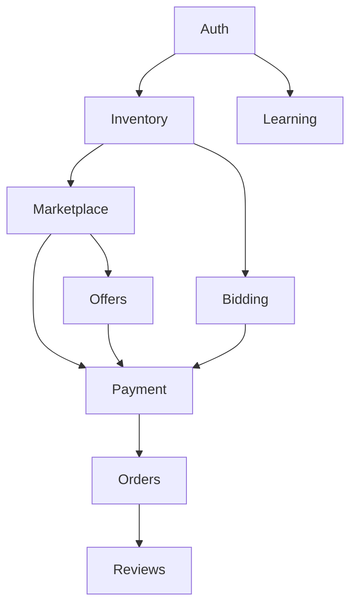

# System Architecture

## High-level

## Auth flow

## Sale finalisation (the choke point)

After a successful Stripe charge, *every* sale path funnels through `utils/finalizeSale.js`:

Implementation: [`backend/utils/finalizeSale.js`](../backend/utils/finalizeSale.js).

## Bid lazy-close

The auction system has no cron job. Instead, **every** `GET /api/bids` and `GET /api/bids/:id` calls [`backend/utils/lazyCloseBids.js`](../backend/utils/lazyCloseBids.js) first, which sweeps any bid where `endTime < now && status === 'active'`, sets `status = 'closed'`, and assigns `winner = currentHighest.customer`. The next time the winner opens the bid detail screen, they see the "You won" banner and a button to pay.

Trade-off: a bid that nobody views after expiry stays `active` in the DB until *someone* lists or opens any bid. Acceptable for this academic project; a Render cron job would be the production fix.

## Module dependency map

This map dictates the build order in `~/.claude/plans/so-the-things-is-sprightly-newt.md`.
