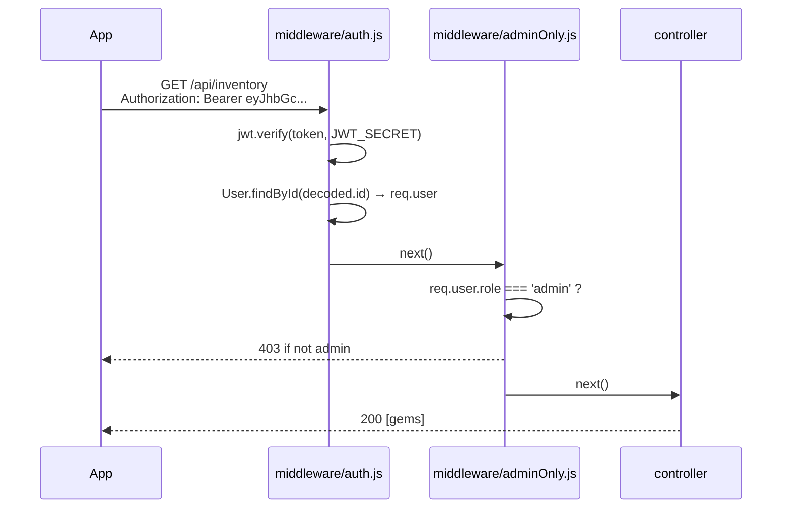

# Group — Authentication

## Shared responsibility (all 6 members must understand)
Auth is the entry point of the entire app. Every protected route depends on it.

## Files
- [backend/models/User.js](../../backend/models/User.js)
- [backend/controllers/authController.js](../../backend/controllers/authController.js)
- [backend/routes/auth.js](../../backend/routes/auth.js)
- [backend/middleware/auth.js](../../backend/middleware/auth.js)
- [backend/middleware/adminOnly.js](../../backend/middleware/adminOnly.js)
- [backend/scripts/seedAdmin.js](../../backend/scripts/seedAdmin.js)
- [mobile/src/context/AuthContext.js](../../mobile/src/context/AuthContext.js)
- [mobile/src/screens/auth/LoginScreen.js](../../mobile/src/screens/auth/LoginScreen.js)
- [mobile/src/screens/auth/RegisterScreen.js](../../mobile/src/screens/auth/RegisterScreen.js)
- [mobile/src/api/client.js](../../mobile/src/api/client.js) — axios interceptor that attaches the JWT

## Endpoints
```
POST /api/auth/register   public   { name, email, password } → { token, user }
POST /api/auth/login      public   { email, password }       → { token, user }
GET  /api/auth/me         token                              → { user }
```

## Password hashing
`bcryptjs.hash(password, 10)` — salted with cost 10 (≈ 100ms per hash, intentional). The plaintext password never leaves the controller; we save only the resulting `passwordHash`.

```js
const passwordHash = await bcrypt.hash(password, 10);
const user = await User.create({ name, email, passwordHash, role: 'customer' });
```

On login: `bcrypt.compare(submittedPassword, user.passwordHash)` returns true/false. We never decrypt — bcrypt is one-way.

## JWT
```js
jwt.sign({ id: user._id, role: user.role }, process.env.JWT_SECRET, { expiresIn: '7d' });
```
The token's payload contains the user ID **and** the role. The role is what `adminOnly` middleware checks — fewer DB lookups than re-fetching the user every request.

## Protected route flow


## Mobile-side persistence
`AuthContext` uses `AsyncStorage`:
- On login: store the token under key `gm_token`
- On app cold start: hydrate the token from AsyncStorage, call `GET /api/auth/me` to refresh the user, drop the token if it's expired
- On logout: remove the key, clear React state

The axios interceptor in `api/client.js` reads `gm_token` on every request and attaches it as `Bearer …`. Screens never deal with tokens directly.

## Role-based UI routing
[`RootNavigator.js`](../../mobile/src/navigation/RootNavigator.js):
```jsx
{user.role === 'admin' ? <AdminTabs /> : <CustomerTabs />}
```
The same protected routes that gate the API also gate the UI — admins never see customer screens and vice versa.

## Likely viva questions

**Q: Why use bcrypt instead of SHA-256?**
A: SHA-256 is fast — too fast. An attacker with leaked hashes could try billions of passwords per second on consumer GPUs. Bcrypt is *deliberately* slow (≈ 100ms per hash at cost 10), so a brute-force attack scales by 1ms × N candidates instead of 1ns × N. The salt also defeats rainbow tables.

**Q: What's stored in the JWT and why?**
A: `{ id, role, iat, exp }`. The id lets us load the user; the role lets `adminOnly` decide without a DB hit; iat/exp are added by jwt.sign. The token is **signed**, not encrypted — anyone who decodes it can read the role, but they can't forge a new one because they don't have `JWT_SECRET`.

**Q: What happens if someone changes their role from customer to admin in the JWT payload?**
A: `jwt.verify` will fail with `JsonWebTokenError: invalid signature` because the HMAC of the new payload doesn't match the original signature. So tampering is impossible without `JWT_SECRET`.

**Q: Why does the seed script use upsert?**
A: So it can safely run multiple times without throwing duplicate-key errors. If admin already exists, it updates the password (useful for resetting it from the env vars).

**Q: How is the admin role established?**
A: Two ways: (1) `npm run seed:admin` upserts an admin user from `.env` credentials. (2) Manually in MongoDB Compass/Atlas, set `role: 'admin'` on any user. Regular `POST /api/auth/register` always creates `role: 'customer'`.

**Q: Why is the password length minimum only 6?**
A: Educational simplicity. Production should require 12+, no dictionary words, etc., or better — delegate to a managed identity provider (Auth0, Cognito).

## How to demo
1. Open the app cold → Login screen.
2. Register a new user → app immediately switches to customer tabs.
3. Log out → back to login.
4. Log in with `admin@gemmarket.local` → app switches to admin tabs.
5. Kill the app and reopen → still logged in (token persisted in AsyncStorage).
