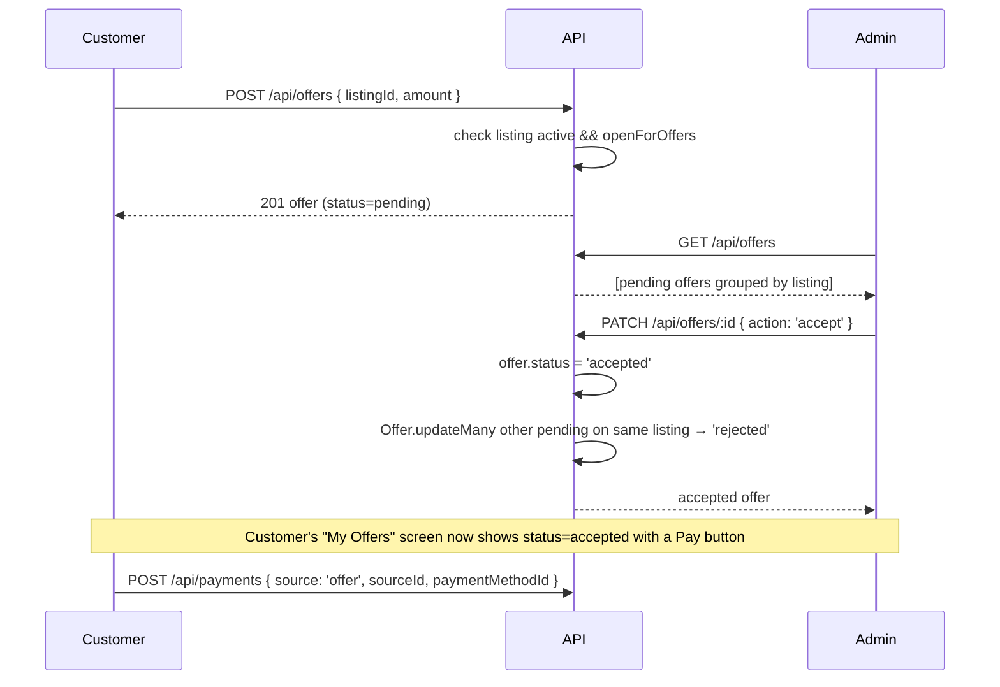

# M3 — Marketplace + Negotiation (Listing + Offer) Module

## Your responsibility
The customer-facing shop. Admins publish gem listings (with photos + optional video), set prices, and toggle whether the listing accepts offers. Customers browse, filter, and either buy outright or submit an offer that the admin can accept/reject.

## Files you own
- [backend/models/Listing.js](../../backend/models/Listing.js)
- [backend/models/Offer.js](../../backend/models/Offer.js)
- [backend/controllers/marketplaceController.js](../../backend/controllers/marketplaceController.js)
- [backend/controllers/offerController.js](../../backend/controllers/offerController.js)
- [backend/routes/marketplace.js](../../backend/routes/marketplace.js)
- [backend/routes/offers.js](../../backend/routes/offers.js)
- [mobile/src/screens/marketplace/*](../../mobile/src/screens/marketplace/) — 4 files
- [mobile/src/screens/offers/AdminOffersScreen.js](../../mobile/src/screens/offers/AdminOffersScreen.js)

## Schemas
**Listing:** `{ gem (ref), price, description, photos: [String], videoUrl, openForOffers, status }`
- `status: active | sold | removed` — soft delete via `removed`; `sold` is set by `finalizeSale` after payment
**Offer:** `{ listing, gem, customer, amount, status: pending|accepted|rejected }`

## Endpoints
```
GET    /api/marketplace?q=&category=&type=&min=&max=  public
GET    /api/marketplace/:id                            public
POST   /api/marketplace        admin · multipart       photos[] (≤6), video?
PUT    /api/marketplace/:id    admin · multipart       (appends photos)
DELETE /api/marketplace/:id    admin                   (soft-delete)

POST   /api/offers             customer
GET    /api/offers/mine        customer
GET    /api/offers             admin
PATCH  /api/offers/:id         admin     { action: 'accept'|'reject' }
```

## Filter implementation
The marketplace controller does the filter in two passes because `q` and `category` filter on the **populated `gem`**, which Mongoose can't do in a single query:
1. Mongo filter on Listing-level fields (`status: active`, `price` range)
2. JavaScript filter on the populated array for `q` (regex on `gem.name` + `description`) and `category` (`gem.type === target`)

This is fine at academic data volume; at scale you'd denormalise `gemName` and `gemType` onto the listing or use `$lookup` pipelines.

## The negotiation flow


The "auto-reject siblings on accept" rule is enforced in **two places**: the offer controller (when admin accepts) AND `finalizeSale` (defence in depth, in case anyone bypasses the controller).

## Likely viva questions

**Q: Why doesn't accepting an offer immediately mark the listing as sold?**
A: Because the customer hasn't paid yet. The accept→pay window can take minutes (or longer if the customer needs to fetch their card). If we marked the listing sold at acceptance, another customer browsing in those minutes would see it gone, but if the accepted customer never pays, we'd have to "un-sell" it. Far cleaner: listing stays active, payment is the trigger, `finalizeSale` is the choke point.

**Q: What stops a customer from making 1000 lowball offers?**
A: Currently nothing. Mitigations to mention: rate-limit the `POST /api/offers` route (e.g. 1 offer per listing per customer per hour), or apply a unique compound index on `(listing, customer)` rejecting pending duplicates. Out of scope for the academic version, but a good "what would you improve" answer.

**Q: Why does the offer document store both `listing` and `gem`?**
A: Denormalisation for performance. The customer's "my offers" view wants to show `gem.name` without an extra populate hop, and the admin's offers view groups by listing — having both refs available means both queries are simple.

**Q: How does multipart upload handle multiple photos?**
A: Multer's `.fields([{ name: 'photos', maxCount: 6 }, { name: 'video', maxCount: 1 }])` parses both into `req.files.photos` (array) and `req.files.video` (array of one). Each file's `.path` is the Cloudinary URL — we map that array onto `listing.photos`.

## How to demo
1. Admin → Inventory → ensure 2 gems exist with stockQty>0.
2. Admin → Listings → + Add → pick gem chip, set price, write description, **enable** "Open for negotiation", attach 2 photos + 1 video, publish.
3. Customer → Market → see listing with `Negotiable` badge → open detail → see image carousel + video → tap **Make an offer** → submit $X.
4. Admin → Offers → tap **Accept** on the offer.
5. Customer's account/offers reflects the accepted state and unlocks payment.
