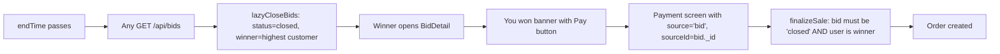

# M5 — Bidding (Auction) Module

## Your responsibility
Time-bound competitive auctions. The admin lists a gem with a starting price and end time; customers place increasing bids until the timer runs out; the highest bidder at expiry becomes the winner and is funnelled to payment.

## Files you own
- [backend/models/Bid.js](../../backend/models/Bid.js)
- [backend/controllers/bidController.js](../../backend/controllers/bidController.js)
- [backend/routes/bids.js](../../backend/routes/bids.js)
- [backend/utils/lazyCloseBids.js](../../backend/utils/lazyCloseBids.js)
- [mobile/src/components/CountdownTimer.js](../../mobile/src/components/CountdownTimer.js)
- [mobile/src/screens/bidding/*](../../mobile/src/screens/bidding/) — 3 files

## Schema
```
{ gem (ref),
  startPrice,
  endTime,
  currentHighest: { amount, customer (ref) },
  history: [{ customer, amount, placedAt }],
  status: 'active'|'closed'|'cancelled',
  winner (ref, set on close) }
```
`history` is the full audit trail for the viva ("show me the bid trail" question).

## Endpoints
```
GET    /api/bids                public  (lazy-closes expired)
GET    /api/bids/:id            public  (lazy-closes expired)
POST   /api/bids                admin   { gemId, startPrice, endTime }
DELETE /api/bids/:id            admin   (soft cancel — sets status='cancelled')
POST   /api/bids/:id/place      customer { amount }
```

## The lazy-close mechanism (the unique part of this module)

Render's free tier sleeps after 15 min idle, so a `node-cron` task running every minute would silently miss firings. Instead, **every** `GET /api/bids` and `GET /api/bids/:id` call invokes `lazyCloseBids()` first:

```js
// backend/utils/lazyCloseBids.js
async function lazyCloseBids() {
  const now = new Date();
  const expired = await Bid.find({ status: 'active', endTime: { $lte: now } });
  for (const bid of expired) {
    bid.status = 'closed';
    bid.winner = bid.currentHighest?.customer || null;
    await bid.save();
  }
}
```

So expiry processing happens **on read**, not on a timer. The first user (customer or admin) who opens the bid list after expiry triggers the sweep.

## Place-bid validation
`bidController.place` rejects with specific status codes:
- `409` if `bid.status !== 'active'`
- `409` if `now >= endTime`
- `400` if `amount <= currentHighest.amount` (with a helpful message containing the current highest)

These are the "what if" scenarios graders love.

## Win → Pay → Order chain


## Likely viva questions

**Q: What if the auction ends but no one views the bid list for hours?**
A: The bid stays `status='active'` in the DB until somebody — winner, admin, any customer browsing — triggers a list/detail call. The first call sweeps. For an academic demo this is acceptable (we'll always be checking during the demo). For production, a Render Cron Job hitting `/api/bids/sweep` every 60s would be the upgrade.

**Q: What stops a customer from placing a bid right at `endTime`?**
A: The check `if (new Date() >= bid.endTime)` is inside `bidController.place` and runs on every request, so the server's clock is the authority. Customer can spoof the countdown timer all they want — at the moment of the POST, the server says "ended" and 409s.

**Q: Why store the full `history` array if only `currentHighest` is needed for validation?**
A: For audit / dispute resolution and for the bid detail UI which shows the running history. The array is small (typical auction has tens of bids, not millions), so embedding inside the bid document is cheaper than a separate `bidEntries` collection with a join.

**Q: What if two customers POST a bid at the exact same instant?**
A: Without a transaction, they both pass the `amount > currentHighest` check independently. The second `save()` to land in MongoDB silently overwrites `currentHighest` to its lower value because Mongoose isn't doing optimistic concurrency. **Fix to mention:** use `findOneAndUpdate` with a conditional `$set` (`amount: { $gt: currentHighest }`) so only one update wins. Worth flagging in the viva as "I know this is a race; here's the fix."

**Q: How does the CountdownTimer component avoid wasting render cycles?**
A: It uses `setInterval(setNow, 1000)` cleanly cleaned up in the `useEffect` return. The format function is pure JS, so each tick is a single `Date.now()` subtraction.

## How to demo
1. Admin → Bids → + New → pick gem chip, set startPrice 100, duration 1 hour.
2. Customer A → Auctions → see the bid with the countdown ticking → tap it → place 150.
3. Customer A places 200; verify highest is 200.
4. Customer B places 180 → backend returns "Bid must be greater than current highest (200)".
5. Admin (for demo speed) sets a new bid with `endTime = now + 60 seconds`. Wait.
6. Refresh the bid list — winner is declared.
7. Winner opens detail → sees "You won 🎉" + Pay button → completes payment → Order appears.
