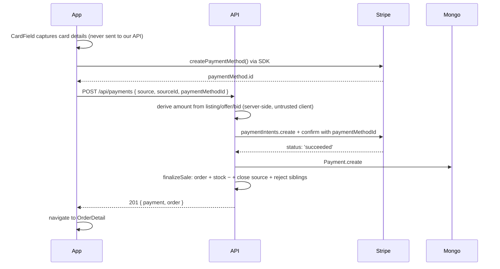

# M6 — Payment + Image Pipeline + Deployment

## Your responsibility
You wear three hats:
1. **Payment integration** — Stripe PaymentIntent flow + the `finalizeSale` choke point used by all three sale paths
2. **Image / video pipeline** — the Cloudinary + Multer middleware reused by M2 (Articles) and M3 (Listings)
3. **Deployment** — getting the backend live on Render with the right env config

## Files you own
- [backend/models/Payment.js](../../backend/models/Payment.js)
- [backend/controllers/paymentController.js](../../backend/controllers/paymentController.js)
- [backend/routes/payments.js](../../backend/routes/payments.js)
- [backend/utils/finalizeSale.js](../../backend/utils/finalizeSale.js)  ← the most important utility in the whole system
- [backend/config/cloudinary.js](../../backend/config/cloudinary.js)
- [backend/middleware/upload.js](../../backend/middleware/upload.js)
- [mobile/src/screens/payment/PaymentScreen.js](../../mobile/src/screens/payment/PaymentScreen.js)
- `mobile/App.js` — the `<StripeProvider publishableKey>` wiring
- [docs/deployment.md](../deployment.md) — your deployment runbook

## Payment flow (memorise this)


**Card details never touch our backend.** Only the Stripe-issued `paymentMethod.id` and (after the call) the `paymentIntent.id` are stored.

## Server-derived amount (security)
The `paymentController.charge` **does not trust** the client's amount. It looks up the listing/offer/bid by `sourceId` and reads the canonical price from there. Otherwise, a malicious client could pay $0.01 for a $50,000 sapphire by tampering with the request body.

## finalizeSale — the choke point
After Stripe confirms success, `finalizeSale({ source, sourceId, customerId, payment })` runs:
1. Look up the source record; verify status is correct (active listing / accepted offer / closed bid won by this customer)
2. Mark the source as sold/used
3. Auto-reject sibling pending offers on the same listing (offer/direct paths)
4. Decrement gem stock; flip availability
5. Create the Order linked to the Payment

If anything throws after the Stripe charge succeeded, the Payment doc is flagged `status='failed'` so an admin sees a "succeeded payment but no order — refund this" trail.

## Image pipeline (shared with M2 + M3)
```js
// backend/config/cloudinary.js
function makeStorage(folder, resourceType = 'auto') {
  return new CloudinaryStorage({
    cloudinary,
    params: {
      folder: `gemmarket/${folder}`,
      resource_type: resourceType,
      allowed_formats: ['jpg','jpeg','png','webp','mp4','mov'],
    },
  });
}

// backend/middleware/upload.js
const articleCoverUpload = multer({ storage: makeStorage('articles','image'), … }).single('cover');
const listingMediaUpload = multer({ storage: makeStorage('listings','auto'), … })
  .fields([{ name:'photos', maxCount:6 }, { name:'video', maxCount:1 }]);
```

## Deployment summary
- Backend → Render web service, root dir `backend/`, build `npm install --legacy-peer-deps`, start `node server.js`
- DB → MongoDB Atlas M0 free, network access `0.0.0.0/0`
- Media → Cloudinary free tier
- Payments → Stripe test mode (`sk_test_…` / `pk_test_…`)
- Mobile → Expo published, `EXPO_PUBLIC_API_URL` points at the Render URL

Full step-by-step in [docs/deployment.md](../deployment.md).

## Likely viva questions

**Q: Why is Stripe processing happening server-side when the SDK could do it client-side?**
A: Two reasons. (1) **Trusted amount** — the server, not the phone, decides how much money to charge based on the canonical listing/bid record. (2) **Side effects must run inside the same request** that confirmed the payment so we can roll back the order if the side-effect step fails. A client-driven flow would split this into two round-trips and risk the customer being charged but never getting an order.

**Q: What happens if Stripe says succeeded but `finalizeSale` throws (e.g. the gem just went out of stock)?**
A: The catch block in `paymentController.charge` flips `payment.status = 'failed'` so the admin can see an orphan payment and refund it manually via the Stripe dashboard. We never silently pocket money. In a more mature system you'd issue an automatic refund via `stripe.refunds.create`.

**Q: Why do you use `automatic_payment_methods.allow_redirects: 'never'`?**
A: We're confirming the PaymentIntent in the same request that creates it, with no chance to redirect the user (e.g. to a 3D Secure page). Setting `allow_redirects: 'never'` tells Stripe to fail rather than return a `requires_action` status in test mode. A production app would handle the redirect on the mobile side.

**Q: Why Cloudinary instead of saving files to disk?**
A: Render's free tier has an **ephemeral filesystem** — every redeploy wipes it. Any uploaded image saved with `multer.diskStorage` would disappear on the next push. Cloudinary is a free CDN with persistent URLs, so the link in `article.coverImageUrl` keeps working forever.

**Q: How does CORS work for the mobile app?**
A: Expo Go and dev builds don't actually enforce CORS the way browsers do (it's a fetch from the JavaScript bridge, not a browser origin), so `cors()` is mostly future-proofing for a web build. The current config in `server.js` is permissive — any origin is allowed — fine for academic demos; for production we'd lock it down with a comma-separated `CORS_ORIGINS` env var.

**Q: Why `--legacy-peer-deps` on install?**
A: `multer-storage-cloudinary@4` pins to multer 1.x, while npm's resolver wants multer 2.x. `--legacy-peer-deps` tells npm to use the resolver from npm 6 era, which doesn't error on this. The `.npmrc` in `backend/` makes this default for the whole team.

## How to demo
1. Show `https://gemmarket-api.onrender.com/api/health` returning JSON.
2. Show admin login from the mobile app pointing at the live URL.
3. Walk through a full purchase: pick a listing → tap Buy → enter `4242 4242 4242 4242` → see Order created.
4. Open Stripe dashboard → Payments → confirm the charge appears.
5. Open Cloudinary dashboard → Media Library → show `gemmarket/listings/` folder with the uploaded photos.
